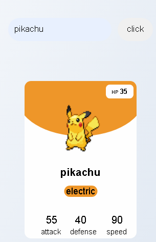
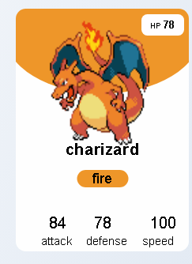

# 🧪 Beginner-Friendly PokéAPI Project

This project demonstrates how to build a simple web application using the [PokéAPI](https://pokeapi.co/) along with **HTML**, **CSS**, and **JavaScript**. It's perfect for beginners looking to explore API integration and DOM manipulation.

## 🚀 Features

- Fetch Pokémon data from PokéAPI
- Display Pokémon name, image, and stats
- Responsive layout using CSS
- Interactive search functionality

## 🛠️ Tech Stack

- HTML5
- CSS3
- JavaScript
- PokéAPI


## 🔍 How It Works

1. User enters a Pokémon name 
2. JavaScript fetches data from the PokéAPI.
3. DOM is updated dynamically to show Pokémon details.

## 📸 Demo




## 🧠 What You’ll Learn

- How to make API calls using `fetch()`
- DOM manipulation using `querySelector`, `innerHTML`, etc.
- Basic error handling
- Styling with Flexbox/Grid

## 📦 Installation

Clone the repo and open `index.html` in your browser:

```bash
git clone https://github.com/RISTONRODZ/Api_projects.git
cd Api_projects


