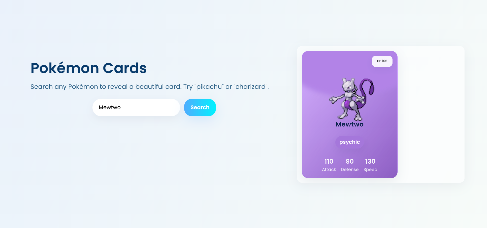

# Pokémon Cards — PokéAPI Demo

Professional, beginner-friendly demo that fetches Pokémon data from the PokéAPI and renders a polished card UI in the browser.

Key points
- Lightweight single-page app using vanilla HTML/CSS/JavaScript
- Uses the PokéAPI (https://pokeapi.co/) for Pokémon details and species color
- Responsive landing page with animated, color-themed cards

Features
- Search Pokémon by name and render a styled card with image, HP and stats
- Card color adapts to the Pokémon species color for a cohesive look
- Toast notifications for errors and input feedback
- Keyboard support (Enter to search)

Quickstart
1. Clone this repository:

```bash
git clone https://github.com/RISTONRODZ/pokemon_cards.git
cd pokemon_cards
```

2. Serve locally (recommended) and open in your browser:

```bash
python3 -m http.server 8000
# then open http://localhost:8000
```

Usage
- Type a Pokémon name (for example: `pikachu`, `charizard`) and press Enter or click Search.
- If the Pokémon is not found a friendly toast notification will appear.

Customization
- The color mapping and visual styling live in `index.html` (CSS and small JS helpers).
- To change theme colors or typography, edit the CSS variables and font import at the top of `index.html`.

Contributing
- Bug reports and small improvements are welcome — open an issue or submit a PR.

License
- This project includes a `LICENSE` file in the repository. Refer to it for licensing details.

Contact
- Maintained by RISTONRODZ. Open an issue on GitHub for questions or help.

Demo

Landing page and example cards (screenshots):


Small Pokémon card examples:





